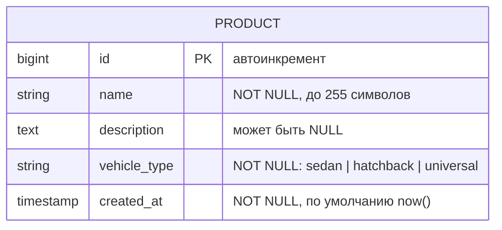

# Схема базы данных каталога

Таблица `product` — товар каталога.

```mermaid
erDiagram
    PRODUCT {
        bigint id PK "автоинкремент"
        string name "NOT NULL, до 255 символов"
        text description "может быть NULL"
        string vehicle_type "NOT NULL: sedan | hatchback | universal"
        timestamp created_at "NOT NULL, по умолчанию now()"
    }
```

`vehicle_type` принимает значения enum `VehicleType`: `sedan`, `hatchback`,
`universal`.
