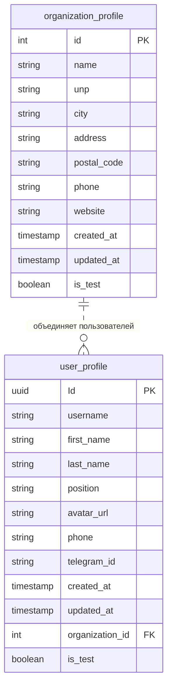

# Структура базы данных Профилей пользователей и организаций

```mermaid

erDiagram
    user_profile {
        uuid Id PK
        string username
        string first_name
        string last_name
        string position
        string avatar_url
        string phone
        string telegram_id
        timestamp created_at
        timestamp updated_at
        int organization_id FK
        boolean is_test
    }

    organization_profile {
        int id PK
        string name
        string unp
        string city
        string address
        string postal_code
        string phone
        string website
        timestamp created_at
        timestamp updated_at
        boolean is_test
    }

    organization_profile ||..o{ user_profile : "объединяет пользователей"

```